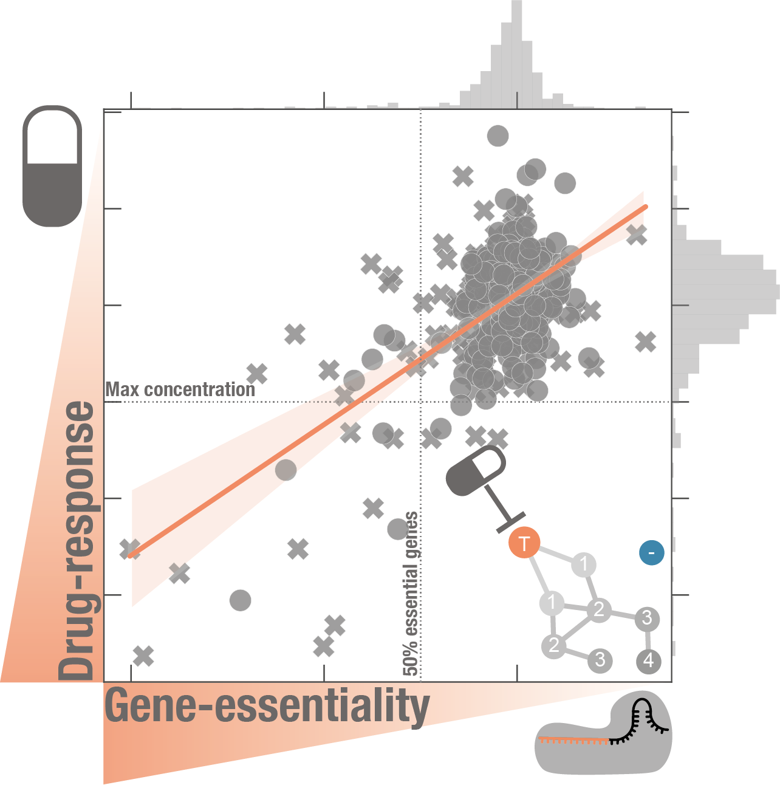

[](https://10.6084/m9.figshare.10333286)

Integration of drug sensitivity and gene essentiality screens inform on drug mode-of-action

Description
--
This module contains all the Python scripts and results of the [analysis](). ipython notebooks are provided in the 
notebooks directory along with all the generated plots from the analysis. 

Clone code repository
```
git clone https://github.com/EmanuelGoncalves/dtrace.git
```

Get data from [figshare](https://doi.org/10.6084/m9.figshare.10338413.v1) and unzip into `dtrace/dtrace/data/` folder.

Install module and initiate jupyter notebooks
```
python3 setup.py sdist bdist_wheel

pip install -U dist/dtrace-0.5.0-py3-none-any.whl

jupyter notebook
```
